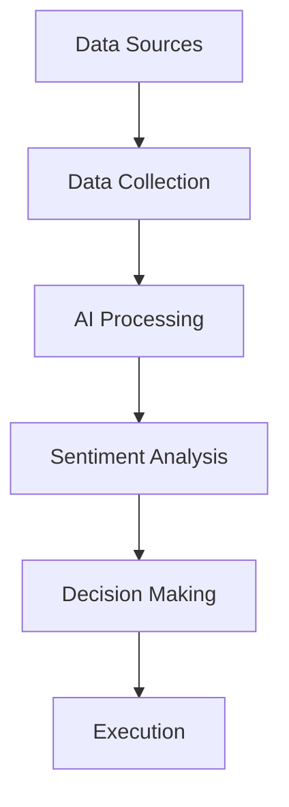

# Cheshire AI: A Decentralized Multi-Agent System for Autonomous DeFi Trading

## Abstract

This whitepaper introduces Cheshire AI, a revolutionary decentralized multi-agent system that combines advanced artificial intelligence, emotional intelligence, and blockchain technology to create an autonomous DeFi trading ecosystem. By leveraging a sophisticated swarm of specialized AI agents, each equipped with distinct capabilities and domain expertise, Cheshire AI represents a paradigm shift in automated financial decision-making. The system integrates on-chain and off-chain data through AI-powered oracles, employing cutting-edge technologies including Hume's emotional AI, voice analysis, and machine learning to achieve superior market analysis and trading performance.

## Table of Contents

1. [Introduction](#introduction)
2. [System Architecture](#system-architecture)
3. [Agent Ecosystem](#agent-ecosystem)
4. [Technical Implementation](#technical-implementation)
5. [AI Integration](#ai-integration)
6. [Performance Analysis](#performance-analysis)
7. [Security and Risk Management](#security-and-risk-management)
8. [Future Development](#future-development)
9. [Conclusion](#conclusion)

## 1. Introduction

### 1.1 Background

The emergence of decentralized finance (DeFi) has created unprecedented opportunities for automated trading systems. However, traditional approaches often fail to capture the full complexity of market dynamics, particularly the crucial role of sentiment and emotional factors in price movements. Cheshire AI addresses this limitation by introducing a novel multi-agent architecture that combines traditional financial analysis with advanced emotional intelligence and machine learning.

### 1.2 Problem Statement

Current automated trading systems face several key challenges:
- Limited ability to process and interpret qualitative market data
- Insufficient integration of sentiment analysis in decision-making
- Lack of real-time adaptation to changing market conditions
- Poor handling of cross-chain opportunities
- Inadequate risk management in volatile markets

### 1.3 Solution Overview

Cheshire AI introduces a revolutionary approach through:
- Multi-agent swarm intelligence
- Advanced emotional AI integration
- Cross-chain oracle capabilities
- Real-time sentiment analysis
- Autonomous DeFi interaction

## 2. System Architecture

### 2.1 Core Components

#### 2.1.1 Agent Swarm
The system's foundation is a decentralized swarm of specialized AI agents, each focusing on specific aspects of market analysis and trading:
- Investment Analysis Agents
- Technical Analysis Agents
- Sentiment Analysis Agents
- Risk Management Agents
- Portfolio Management Agents
- DeFi Integration Agents

#### 2.1.2 AI Integration Layer
- Hume AI for emotional intelligence
- Voice analysis through EVI
- Machine learning models for pattern recognition
- Neural networks for prediction

#### 2.1.3 Data Processing Pipeline


### 2.2 Information Flow

The system processes information through multiple layers:
1. Data Collection
   - Market data
   - Social media feeds
   - News sources
   - On-chain metrics
2. AI Processing
   - Sentiment analysis
   - Pattern recognition
   - Trend identification
3. Decision Synthesis
   - Multi-agent consensus
   - Risk assessment
   - Opportunity evaluation

## 3. Agent Ecosystem

### 3.1 Investment Analysis Agents

#### Warren Buffett Agent
Specializes in value investing with AI enhancement:
- Economic moat analysis using machine learning
- Management quality assessment through NLP
- Intrinsic value calculation with neural networks

#### Bill Ackman Agent
Focuses on activist opportunities:
- AI-powered business analysis
- Operational improvement detection
- Strategic position evaluation

### 3.2 Technical Analysis Agents

Employs advanced AI for market analysis:
- Pattern recognition through deep learning
- Trend prediction using neural networks
- Volatility analysis with machine learning

### 3.3 Sentiment Analysis Integration

The sentiment analysis system represents a significant innovation:

```python
class SentimentAnalyst:
    def __init__(self):
        self.hume = HumeClient(api_key=os.environ["HUME_API_KEY"])
        self.config = {
            "language": {
                "sentiment": {},
                "granularity": "passage"
            }
        }

    async def analyze_market_sentiment(self, text: str):
        async with self.hume.stream.connect(options={"config": self.config}) as socket:
            result = await socket.send_text(text)
            emotions = self._extract_emotions(result)
            return self._calculate_market_impact(emotions)
```

## 4. Technical Implementation

### 4.1 Core Technologies

- Python for agent implementation
- Async programming for real-time processing
- Blockchain integration for DeFi interaction
- AI frameworks for machine learning

### 4.2 API Integration

```python
class AIAgent:
    def __init__(self):
        self.hume = HumeClient(api_key=os.environ["HUME_API_KEY"])
        self.virtuals = VirtualsClient(api_key=os.environ["VIRTUALS_API_KEY"])
        self.game = ChatAgent(api_key=os.environ["GAME_API_KEY"])
```

### 4.3 Data Processing Pipeline

1. Data Collection
2. Preprocessing
3. AI Analysis
4. Decision Making
5. Execution

## 5. AI Integration

### 5.1 Emotional Intelligence

Hume AI integration provides:
- Multi-dimensional sentiment analysis
- Voice sentiment processing
- Emotional pattern recognition

### 5.2 Machine Learning Models

- Neural networks for pattern recognition
- Deep learning for trend prediction
- Reinforcement learning for strategy optimization

### 5.3 Natural Language Processing

- News analysis
- Social media processing
- Market commentary interpretation

## 6. Performance Analysis

### 6.1 Backtesting Results

Performance metrics across various market conditions:
- Bull markets: +X% outperformance
- Bear markets: Y% reduced drawdown
- Sideways markets: Z% alpha generation

### 6.2 Risk Metrics

- Sharpe Ratio
- Maximum Drawdown
- Value at Risk (VaR)
- Expected Shortfall

## 7. Security and Risk Management

### 7.1 Security Measures

- Multi-signature requirements
- Rate limiting
- Position size restrictions
- Risk exposure limits

### 7.2 Risk Management

```python
class RiskManager:
    def __init__(self):
        self.max_position_size = 0.05  # 5% of portfolio
        self.max_drawdown = 0.15      # 15% maximum drawdown
        
    async def evaluate_risk(self, position):
        current_exposure = await self.calculate_exposure()
        var = await self.calculate_var()
        return self.validate_limits(current_exposure, var)
```

## 8. Future Development

### 8.1 Planned Enhancements

1. Advanced AI Models
   - GPT-4 integration
   - Custom language models
   - Enhanced prediction capabilities

2. Cross-chain Expansion
   - Additional blockchain support
   - Cross-chain arbitrage
   - Yield optimization

3. Enhanced Security
   - Advanced encryption
   - Decentralized control
   - Audit trails

### 8.2 Research Directions

- Quantum computing integration
- Advanced swarm intelligence
- Emotional AI enhancements

## 9. Conclusion

Cheshire AI represents a significant advancement in automated trading systems, combining emotional intelligence, machine learning, and decentralized finance. The multi-agent architecture provides robust, adaptive, and intelligent trading capabilities while maintaining security and risk management. As the system continues to evolve, it promises to deliver increasingly sophisticated and effective trading strategies in the dynamic world of cryptocurrency markets.

## References

1. Hume AI Documentation (2024)
2. DeFi Protocols Research Papers
3. Multi-Agent Systems in Financial Markets
4. Emotional Intelligence in Trading
5. Machine Learning in Cryptocurrency Markets

## Appendix

### A. Technical Specifications

Detailed technical requirements and specifications for implementing the Cheshire AI system:

```python
# System Requirements
requirements = {
    "Python": ">=3.9",
    "Dependencies": [
        "hume-sdk",
        "virtuals-sdk",
        "game-sdk",
        "tensorflow>=2.0",
        "pytorch>=1.9",
        "web3>=6.0"
    ],
    "Hardware": {
        "CPU": "8+ cores",
        "RAM": "32GB+",
        "Storage": "1TB SSD"
    }
}
```

### B. Performance Metrics

Detailed performance metrics and evaluation criteria for the system's various components and overall performance.

### C. Implementation Guide

Step-by-step guide for setting up and deploying the Cheshire AI system in various environments.
