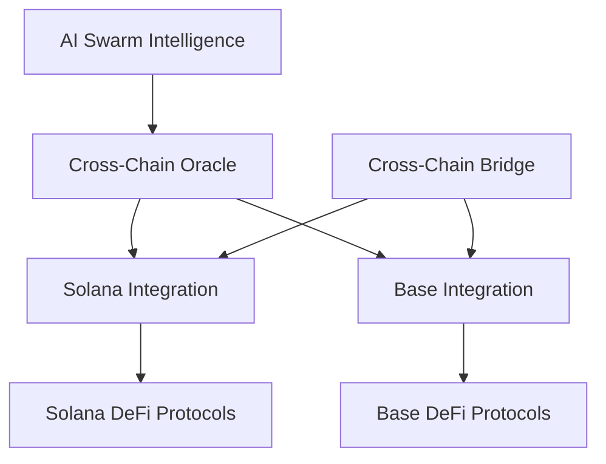

# Solana and Base Blockchain Integration


## Introduction to Cross-Chain Architecture

The Cheshire Terminal's cross-chain architecture represents one of its most innovative aspects, enabling the AI hedge fund to operate seamlessly across both Solana and Base (Ethereum L2) blockchains. This guide explores the technical implementation, benefits, and unique features of this cross-chain integration.

## Table of Contents

1. [Cross-Chain Strategy Overview](#cross-chain-strategy-overview)
2. [Solana Integration](#solana-integration)
3. [Base (Ethereum L2) Integration](#base-ethereum-l2-integration)
4. [Cross-Chain Bridging Mechanism](#cross-chain-bridging-mechanism)
5. [Smart Contract Architecture](#smart-contract-architecture)
6. [Oracle Implementation](#oracle-implementation)
7. [Performance Considerations](#performance-considerations)
8. [Security Measures](#security-measures)

## Cross-Chain Strategy Overview

### The Multi-Chain Advantage

The Cheshire Terminal's cross-chain strategy provides several key advantages:

- **Diversified Opportunity Set**: Access to trading and yield opportunities across multiple blockchain ecosystems
- **Risk Distribution**: Reduced exposure to blockchain-specific risks through diversification
- **Liquidity Optimization**: Ability to move assets between chains to optimize for liquidity and fees
- **Arbitrage Potential**: Exploitation of price differences and yield disparities between chains

### Technical Architecture Overview

The cross-chain system works through a coordinated infrastructure:



## Solana Integration

### Advantages of Solana

The Cheshire Terminal leverages Solana's unique attributes:

- **High Transaction Throughput**: Ability to execute 65,000+ transactions per second
- **Sub-second Finality**: Near-instant confirmation of transactions
- **Low Transaction Costs**: Minimal fees for frequent trading operations
- **Composable DeFi Ecosystem**: Rich ecosystem of interoperable protocols
- **Rich On-Chain Data**: Extensive data availability for real-time analytics

### Solana Analytics Agent

The Cheshire Terminal includes a specialized Solana Analytics Agent that provides real-time on-chain data insights to the AI swarm. This agent leverages the solana-py library to connect directly to Solana's RPC endpoints and gather critical blockchain metrics:

```python
class SolanaAnalyticsAgent:
    """
    Solana Analytics Agent that provides on-chain data insights for the AI swarm
    """
    
    def __init__(self):
        # Get environment variables for Solana endpoints
        self.mainnet_url = os.environ.get("SOLANA_MAINNET_URL", "https://api.mainnet-beta.solana.com")
        self.devnet_url = os.environ.get("SOLANA_DEVNET_URL", "https://api.devnet.solana.com")
        
        # Initialize clients (we'll lazily connect when needed)
        self.mainnet_client = None
        self.devnet_client = None
        
        # Track popular Solana tokens and their mint addresses
        self.token_mints = {
            "SOL": None,  # Native SOL doesn't have a mint
            "USDC": "EPjFWdd5AufqSSqeM2qN1xzybapC8G4wEGGkZwyTDt1v",
            "BONK": "DezXAZ8z7PnrnRJjz3wXBoRgixCa6xjnB7YaB1pPB263",
            "JTO": "jtojtomepa8beP8AuQc6eXt5FriJwfFMwQx2v2f9mCL",
            "PYTH": "HZ1JovNiVvGrGNiiYvEozEVgZ58xaU3RKwX8eACQBCt3"
        }
```

The agent monitors key on-chain metrics including:

- **Network Performance**: TPS, slot times, and network health
- **Token Supply**: Circulating and total supply for major assets
- **DEX Activity**: Trading volume and liquidity across major Solana DEXes
- **Transaction Volume**: Overall network activity metrics
- **Market Sentiment**: Analysis of on-chain signals to determine market mood

### Technical Implementation

The Solana integration uses the solana-py library for RPC interactions and blockchain data retrieval:

```python
async def get_recent_performance(self) -> Dict[str, Any]:
    """Get recent Solana network performance metrics"""
    client = await self.get_mainnet_client()
    
    # Get recent performance samples
    response = await client.get_recent_performance_samples(limit=10)
    
    if response.value:
        samples = response.value
        
        # Calculate average TPS
        avg_tps = sum(sample.num_transactions / sample.sample_period_secs for sample in samples) / len(samples)
        
        # Calculate average slot time
        avg_slot_time = sum(sample.sample_period_secs / sample.num_slots for sample in samples) / len(samples)
        
        return {
            "avg_tps": round(avg_tps, 2),
            "avg_slot_time": round(avg_slot_time, 3),
            "sample_count": len(samples),
            "timestamp": datetime.now().isoformat()
        }
```

The agent also converts raw blockchain data into actionable insights through sentiment analysis:

```python
async def analyze_on_chain_sentiment(self) -> Dict[str, Any]:
    """Analyze on-chain activity to determine market sentiment"""
    # Gather data from multiple sources
    perf_data = await self.get_recent_performance()
    sol_supply = await self.get_token_supply("SOL")
    dex_activity = await self.get_dex_activity()
    tx_count = await self.get_transaction_count(24)
    price_impact = await self.get_sol_price_impact()
    
    # Calculate sentiment signals based on metrics
    activity_score = 0
    sentiment_signals = []
    
    # Network performance signal
    if perf_data.get("avg_tps", 0) > 2500:
        activity_score += 1
        sentiment_signals.append("High network activity")
    
    # Return sentiment assessment
    sentiment = "neutral"
    confidence = 50
    
    if activity_score >= 3:
        sentiment = "bullish"
        confidence = 70 + (activity_score - 3) * 10
    elif activity_score <= 1:
        sentiment = "bearish"
        confidence = 60
    
    return {
        "sentiment": sentiment,
        "confidence": min(confidence, 95),
        "activity_score": activity_score,
        "signals": sentiment_signals
    }
```

### Solana DeFi Protocol Integration

The system integrates with leading Solana DeFi protocols:

- **Serum/OpenBook**: For decentralized exchange trading
- **Marinade Finance**: For staking and liquid staking tokens
- **Raydium**: For automated market making and liquidity provision
- **Solend**: For lending and borrowing operations

## Base (Ethereum L2) Integration

### Advantages of Base

Base integration provides access to:

- **Ethereum Ecosystem**: The largest and most established DeFi ecosystem
- **Layer 2 Efficiency**: Lower costs and higher throughput compared to Ethereum mainnet
- **Strong Security Model**: Inherited security from Ethereum L1
- **Optimistic Rollup Technology**: Efficient and secure transaction batching

### Technical Implementation

The Base integration utilizes Web3 libraries and optimistic rollup interactions:

```python
# Sample Base integration code
from web3 import Web3
from eth_account import Account
import json

class BaseIntegration:
    def __init__(self, rpc_url, private_key):
        self.w3 = Web3(Web3.HTTPProvider(rpc_url))
        self.account = Account.from_key(private_key)
    
    async def interact_with_protocol(self, contract_address, contract_abi, method_name, params):
        # Load contract
        contract = self.w3.eth.contract(address=contract_address, abi=contract_abi)
        
        # Build transaction
        function = getattr(contract.functions, method_name)
        transaction = function(*params).build_transaction({
            'from': self.account.address,
            'nonce': self.w3.eth.get_transaction_count(self.account.address),
            'gas': 2000000,
            'gasPrice': self.w3.eth.gas_price
        })
        
        # Sign and send transaction
        signed_tx = self.account.sign_transaction(transaction)
        tx_hash = self.w3.eth.send_raw_transaction(signed_tx.rawTransaction)
        return self.w3.eth.wait_for_transaction_receipt(tx_hash)
```

### Base DeFi Protocol Integration

The Cheshire Terminal integrates with key Base protocols:

- **Uniswap**: For decentralized exchange trading
- **Aave**: For lending and borrowing operations
- **Compound**: For money market operations
- **Balancer**: For automated portfolio management

## Cross-Chain Bridging Mechanism

### Custom Bridge Implementation

The Cheshire Terminal implements a custom bridging mechanism:

```python
class CheshireBridge:
    def __init__(self, solana_integration, base_integration, 
                 wormhole_contract, portal_contract):
        self.solana = solana_integration
        self.base = base_integration
        self.wormhole_contract = wormhole_contract
        self.portal_contract = portal_contract
    
    async def bridge_assets(self, source_chain, target_chain, 
                           asset_address, amount, recipient):
        if source_chain == "solana" and target_chain == "base":
            return await self._bridge_solana_to_base(
                asset_address, amount, recipient
            )
        elif source_chain == "base" and target_chain == "solana":
            return await self._bridge_base_to_solana(
                asset_address, amount, recipient
            )
        else:
            raise ValueError("Unsupported chain combination")
```

### Third-Party Bridge Integration

The system also integrates with established cross-chain bridges:

- **Wormhole**: For secure token transfers between chains
- **Portal Bridge**: For wrapped asset transfers
- **Axelar Network**: For cross-chain communication and general message passing
- **LayerZero**: For omnichain interoperability

## Smart Contract Architecture

### Agent-Based Smart Contracts

The Cheshire Terminal deploys agent-specific smart contracts on both chains:

```solidity
// Sample Solidity contract for Base (simplified)
contract CheshireAgent {
    address public owner;
    address public fundManager;
    
    constructor(address _fundManager) {
        owner = msg.sender;
        fundManager = _fundManager;
    }
    
    function executeStrategy(
        address[] calldata targets,
        bytes[] calldata callData,
        uint256[] calldata values
    ) external onlyFundManager returns (bytes[] memory) {
        require(targets.length == callData.length, "Length mismatch");
        require(targets.length == values.length, "Length mismatch");
        
        bytes[] memory results = new bytes[](targets.length);
        
        for (uint i = 0; i < targets.length; i++) {
            (bool success, bytes memory result) = targets[i].call{value: values[i]}(callData[i]);
            require(success, "Transaction execution failed");
            results[i] = result;
        }
        
        return results;
    }
    
    modifier onlyFundManager() {
        require(msg.sender == fundManager, "Only fund manager can call");
        _;
    }
}
```

### Rust Program for Solana

On Solana, the agents operate through Rust programs:

```rust
use solana_program::{
    account_info::{next_account_info, AccountInfo},
    entrypoint,
    entrypoint::ProgramResult,
    msg,
    program_error::ProgramError,
    pubkey::Pubkey,
};

entrypoint!(process_instruction);

pub fn process_instruction(
    program_id: &Pubkey,
    accounts: &[AccountInfo],
    instruction_data: &[u8],
) -> ProgramResult {
    // Parse instruction data
    let instruction = CheshireInstruction::unpack(instruction_data)?;
    
    // Process based on instruction type
    match instruction {
        CheshireInstruction::ExecuteStrategy { targets, data } => {
            execute_strategy(program_id, accounts, targets, data)
        }
        CheshireInstruction::UpdateAuthority { new_authority } => {
            update_authority(program_id, accounts, new_authority)
        }
    }
}
```

## Oracle Implementation

### AI-Powered Oracle System

The Cheshire Terminal functions as an AI-powered oracle, with the Solana Analytics Agent playing a crucial role in providing real-time blockchain data:

```python
class CheshireOracle:
    def __init__(self, agents, solana_integration, base_integration):
        self.agents = agents
        self.solana = solana_integration
        self.base = base_integration
    
    async def generate_market_signals(self):
        # Collect analysis from all agents
        signals = {}
        for name, agent in self.agents.items():
            signals[name] = await agent.analyze(self.current_state)
        
        # Give extra weight to on-chain data
        solana_data = signals.get("solana_analytics", {}).get("analysis", {})
        if "on_chain_sentiment" in solana_data:
            # Incorporate on-chain sentiment into overall analysis
            on_chain_sentiment = solana_data["on_chain_sentiment"]
            self.current_state["on_chain_sentiment"] = on_chain_sentiment
        
        # Synthesize signals into actionable intelligence
        consensus = self.reach_consensus(signals)
        
        # Publish signals to both chains
        await self.publish_to_solana(consensus)
        await self.publish_to_base(consensus)
        
        return consensus
    
    async def publish_to_solana(self, consensus):
        # Convert consensus to Solana-compatible format
        instruction_data = self.format_for_solana(consensus)
        
        # Publish to Solana
        return await self.solana.execute_trade(
            instruction_data, 
            self.oracle_program_id
        )
    
    async def publish_to_base(self, consensus):
        # Convert consensus to Base-compatible format
        params = self.format_for_base(consensus)
        
        # Publish to Base
        return await self.base.interact_with_protocol(
            self.oracle_contract_address,
            self.oracle_contract_abi,
            "updateMarketSignals",
            params
        )
```

### On-Chain Data Integration

The Solana Analytics Agent provides critical real-time data that gives the AI swarm a significant edge:

1. **Network Health Metrics**: TPS and slot time information helps identify network congestion or potential issues
2. **DEX Activity Monitoring**: Trading volume and liquidity data across major Solana DEXes
3. **Smart Money Tracking**: Monitoring of key program interactions to identify institutional activity
4. **Token Supply Analysis**: Understanding circulating supply changes for major tokens
5. **Sentiment Derivation**: Converting on-chain metrics into actionable sentiment signals

When integrated into the swarm's decision-making process, these on-chain signals provide a unique data advantage that traditional trading systems lack.

### Cross-Chain Data Availability

The oracle system ensures data consistency across chains:

- **Chain-Specific Formatting**: Adapting signals for each blockchain's requirements
- **Consistency Verification**: Ensuring published signals match across chains
- **Latency Management**: Handling different block time requirements
- **Failure Recovery**: Automatic retry mechanisms for publishing failures

## Performance Considerations

### Optimization Strategies

The cross-chain system employs several optimization strategies:

- **Batched Transactions**: Grouping operations to reduce overall transaction costs
- **Gas Optimization**: Fine-tuned contract code to minimize gas consumption
- **MEV Protection**: Strategies to prevent miner/validator extractable value attacks
- **Transaction Prioritization**: Critical operations receive higher gas/fee settings

### Performance Monitoring

The system continuously monitors cross-chain performance:

```python
class PerformanceMonitor:
    def __init__(self, solana_integration, base_integration):
        self.solana = solana_integration
        self.base = base_integration
        self.metrics = {
            "solana": {
                "tx_count": 0,
                "success_rate": 0,
                "avg_latency": 0,
                "total_fees": 0
            },
            "base": {
                "tx_count": 0,
                "success_rate": 0,
                "avg_latency": 0,
                "total_fees": 0
            }
        }
    
    async def record_transaction(self, chain, tx_hash, start_time, fee):
        # Record transaction metrics
        if chain == "solana":
            status = await self.solana.client.get_transaction(tx_hash)
            end_time = time.time()
            latency = end_time - start_time
            
            self.metrics["solana"]["tx_count"] += 1
            self.metrics["solana"]["avg_latency"] = (
                (self.metrics["solana"]["avg_latency"] * (self.metrics["solana"]["tx_count"] - 1) + latency) /
                self.metrics["solana"]["tx_count"]
            )
            self.metrics["solana"]["total_fees"] += fee
            
            if status["result"] and status["result"]["meta"]["status"]["Ok"]:
                self.metrics["solana"]["success_rate"] = (
                    (self.metrics["solana"]["success_rate"] * (self.metrics["solana"]["tx_count"] - 1) + 1) /
                    self.metrics["solana"]["tx_count"]
                )
            
        # Similar implementation for Base...
```

## Security Measures

### Multi-Chain Security Model

The Cheshire Terminal implements comprehensive security measures:

- **Multi-Signature Requirements**: Critical operations require multiple signatures
- **Time-Locked Transactions**: Important changes are subject to time delays
- **Circuit Breakers**: Automatic trading halts based on predefined conditions
- **Continuous Auditing**: Ongoing monitoring for suspicious activities

### Risk Management

Cross-chain operations involve specific risks that are actively managed:

- **Bridge Risk Mitigation**: Limiting exposure to any single bridge
- **Chain Outage Contingency**: Procedures for handling blockchain-specific downtime
- **Slippage Protection**: Mechanisms to prevent excessive slippage during cross-chain transfers
- **Gas Reserve Management**: Maintaining sufficient gas tokens on each chain

## Conclusion

The Cheshire Terminal's integration with Solana and Base blockchains represents a sophisticated approach to cross-chain DeFi operations. By leveraging the unique strengths of each blockchain while mitigating their individual limitations, the system creates a robust and flexible trading infrastructure.

This multi-chain architecture, powered by AI swarm intelligence, enables the Cheshire Terminal to unlock new opportunities that would be impossible on any single blockchain. As cross-chain technology continues to evolve, the Cheshire Terminal is well-positioned to incorporate additional blockchains and expand its operational capabilities.

---

*This guide is part of the official documentation for the Cheshire Terminal Social Swarm and Hedge Fund project.*
